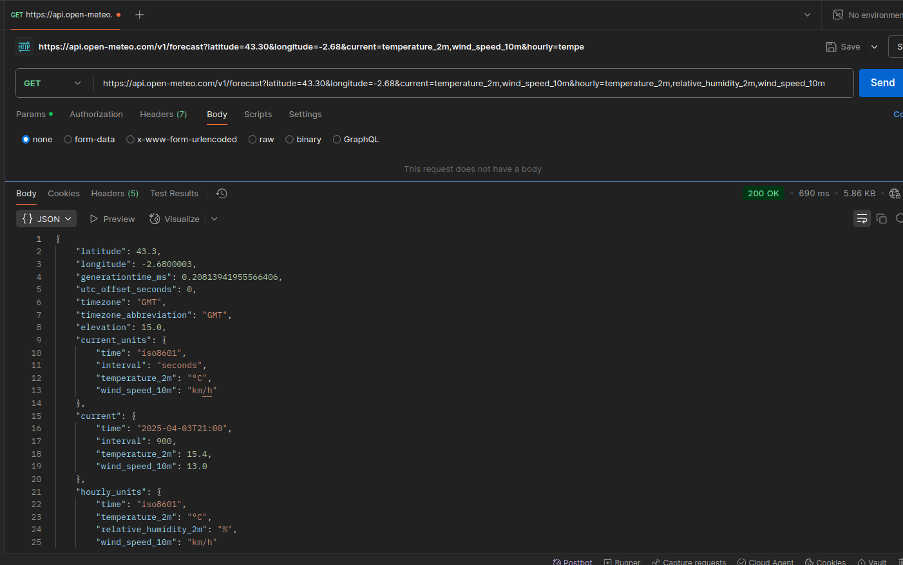

# Cuestionario Checkpoint 6
Inti Luna
2025-04-03

## 1. ¿Para qué usamos Clases en Python?

Object Oriented Programming (**OOP**) es una manera de diseñar software
que nos permite pensar en complejos programas en terminos de objetos del
mundo real. OOP permite crear programas complejos, reducir los errores y
reduce la repeteción de código.

En OOP, un programa o software se compone de muchos objetos
individuales. Por ejemplo, un objeto en un programa basado en OOP puede
ser una persona que tiene ciertos atributos (nombre, edad, dirección) y
puede realizar ciertas acciones (caminar, hablar, respirar, comer,
dormir).

Las **clases** en python se usan para crear objetos. Una manera de ver a
las clases es como un molde de galleta y los objetos que creamos a
partir de una clase, se les llama instancias que serian las galletas. Al
proceso de crear los objetos a partir de una clase se le llama
**instantiation**. Otro punto importante de recordar es quen con las
clases se define el tipo de objeto y recuerda que con la función
**type** se puede obtener la clase de objeto que para un objeto tipo
string se obtiene “str”.


``` python
my_cat = "Nala"
print(type(my_cat))
```

    <class 'str'>

Referencias

<https://realpython.com/videos/what-object-oriented-programming-oop/>

<https://snakebear.science/08-Classes/classes.html>

## 2. ¿Qué método se ejecuta automáticamente cuando se crea una instancia de una clase?

Para poder explicar mejor el método que se ejecuta para crear una
instancia a partir de una clase vamos a ver como se define una clase y
los diferentes elementos. Para crear una clase en python se usa la
palabra reservada **class** seguida por el nombre de la clase con la
primera letra en mayuscula.

Recordamos que los metodos son un tipo de función que esta definida
dentro de una clase y que opera sobre instancias de esa clase. En la
clase hay un método especial que se llama iniciador o initializer y se
define con **`_ _init_ _`**. Este método que en otros lenguajes se le
llama constructor es llamado cuando se crea un objeto o instancia a
partir de la clase. Con este método se define los atributos que va a
tener el objeto creado a partir de la clase. Por ejemplo, definimos una
clase Galleta con atributos como nombre, color, olor e ingredientes:

``` python
class Galleta:
  
  def __init__(self,nombre,color,olor,ingredientes):
    self.nombre = nombre
    self.color = color
    self.olor = olor
    self.ingredientes = ingredientes
```

En la definición de la clase se definen los atributos del objeto a
crear. Es de notar que hay un atributo “self” que es una atributo usado
para referenciar al propio objeto, por convención se usa “self” pero
puede tener otro nombre y funcionar igual. En otras palabras estamos
diciendo que a este objeto asignale al atributo nombre usando el
argumento nombre que le pasamos al crear la instancia.

Estos atributos hasta ahora definidos son especificos para cada objeto
creado, pero hay otro tipo de atributo llamados atributos de clase que
son comunes entre todos los objetos y que tiene valores predeterminados
. Vamos a ver en nuestro ejemplo donde se definen y algunas
posibilidades:

``` python
class Galleta:
  tipo = "Dulce"             
  forma_predeterminada = "Redonda"
  
  def __init__(self,nombre,color,olor,ingredientes):
    self.nombre = nombre
    self.color = color
    self.olor = olor
    self.ingredientes = ingredientes
```

Para crear un objeto a partir de esta clase le pasamos los atributos al
nombre de la clase. En el siguiente ejemplo veremos como cada objeto
creado tiene atributos de instancia especifico y atributos de clases
comunes:

``` python
chocogalleta = Galleta(nombre="Chocogalleta",
                       color="oscuro",
                       olor="chocolate",
                       ingredientes=["harina", "chocolate", "leche","avena","azucar"])
                    
print("Atributos para Chocogalleta")
print(f"color:{chocogalleta.color}")
print(f"ingredientes:{chocogalleta.ingredientes}")
print(f"tipo:{chocogalleta.tipo}")

galleta_avena = Galleta(nombre="Galleta de avena",
                       color="claro",
                       olor="canela y avena",
                       ingredientes=["harina", "leche","avena","canela","azucar"])
                    
print("Atributos para galleta de Avena")
print(f"color:{galleta_avena.color}")
print(f"ingredientes:{galleta_avena.ingredientes}")
print(f"tipo:{galleta_avena.tipo}")
```

    Atributos para Chocogalleta
    color:oscuro
    ingredientes:['harina', 'chocolate', 'leche', 'avena', 'azucar']
    tipo:Dulce
    Atributos para galleta de Avena
    color:claro
    ingredientes:['harina', 'leche', 'avena', 'canela', 'azucar']
    tipo:Dulce

Referencias

<https://realpython.com/lessons/adding-attributes-python-class/>

<https://snakebear.science/08-Classes/classes.html>

## 3. ¿Cuáles son los tres verbos de API?

**Rest API’s** son las más comunes y estas API usan el **prótocolo
HTTP** que contempla varias acciones que se pueden realizar o métodos:

**GET**. Se usa para leer información u obtener información de un
recurso en un servidor sin modificarlo. Por ejemplo, podemos usar un GET
para obtener del un API del servicio meteorologico, el prónostico del
clima para el día de mañana.

**POST**. Se usa para crear un nuevo recurso o registro. Por ejemplo,
cuando creamos una cuenta en una web app, por detras el backend realiza
una solicitud de POST a la base de datos en el servidor con nuestros
datos para crear un nuevo usuario.

**PUT** Se usa para actualizar o reemplazar un recurso con información
nueva. Por ejemplo,este método se utiliza cuando actualizamos nuestros
datos de contacto en un sitio web y en la solicitud se requiere el
identificador del recurso a actualizar.

**DELETE** Se usa para eliminar datos de una base de datos y para ello
se envia un identificador del recurso al igual quen en DELETE.

Referencias:

<https://aws.amazon.com/what-is/api/>

<https://blog.postman.com/what-are-http-methods/>

<https://realpython.com/api-integration-in-python/>

## 4. ¿Es MongoDB una base de datos SQL o NoSQL?

MongoDB es una base de datos NoSQL que significa “Not Only SQL” y es un
tipo de base de datos que emplea un esquema flexible, permite almacenar,
ingerir y recuperar datos no estructurados y semiestructurados.

En dependencia del caso de uso, se debe de elegir un tipo de base de
datos u otra. En general se usan las bases de datos relacionales pero
hay casos donde no son la mejor alternativa.

Algunas propiedades de las bases NoSQL les hacen aptos para: - Hay
muchos datos semiestructurados o no estructurados - Se requiere alta
escalabilidad - No se conoce de antemano el esquema y/o requiere
flexibilidad - Las relaciones entre tablas o entidades no es tan
importante

### Tipos de bases de datos NoSQL

Dentro de las bases de datos NoSQL se encuentran:

**Documentos**.Almacena datos en objetos similares a JSON llamados
documentos y al grupo se le conoce como colección.

**Clave-Valor**. Se usan pares clave valor siendo la clave unica.

**Familia de columnas**. Se organiza en columnas en lugar de filas.

**Datos de grafos**.Se almacenan en nodos y bordes En las bases de datos
SQL o bases de datos relacionales se tiene un esquema rigido tabular y
se puede analizar usando lenguaje SQL. En este tipo de bases de datos,
lo primordial es la relación entre muchas entidades o tablas.

Referencias:

<https://www.mongodb.com/es/resources/basics/databases/nosql-explained/nosql-vs-sql>

<https://sqlinsix.medium.com/when-to-use-sql-or-nosql-b50d4a52c157>

<https://memgraph.com/blog/when-to-use-a-nosql-database>

## 5. ¿Qué es una API?

Application programming interface (API) o interfaz de programación de
aplicaciones son mecanismos que permiten a dos componentes de software
(aplicaciones) comunicarse entre sí mediante un conjunto de protocolos.
Una manera de ver a una API es como un acuerdo donde se define como se
deberia comunicarse con la interfaz, con la definición de las
solicitudes y respuestas. La documentación de la API describe como los
desarrolladores deben estructurar las solicitudes y las respuestas que
obtendran.

A la aplicación que envia la solicitud se le conoce como el cliente y a
la que responde como el servidor. Con estos terminos se pueden describir
diferentes tipos de arquitectura:

**API de SOAP**

Estas API utilizan el protocolo simple de acceso a objetos. El cliente y
el servidor intercambian mensajes mediante XML. Se trata de una API
menos flexible que era más popular en el pasado.

**API de RPC**

Estas API se denominan llamadas a procedimientos remotos. El cliente
completa una función (o procedimiento) en el servidor, y el servidor
devuelve el resultado al cliente.

**API de REST (Representational State Transfer)**

Estas son las API más populares y flexibles que se encuentran en la web
actualmente. El cliente envía las solicitudes al servidor como datos. El
servidor utiliza esta entrada del cliente para iniciar funciones
internas y devuelve los datos de salida al cliente.

**API de WebSocket**

La API de WebSocket es otro desarrollo moderno de la API web que utiliza
objetos JSON para transmitir datos. La API de WebSocket admite la
comunicación bidireccional entre las aplicaciones cliente y el servidor.
El servidor puede enviar mensajes de devolución de llamada a los
clientes conectados, por lo que es más eficiente que la API de REST.

Referencias:

<https://aws.amazon.com/what-is/api/>

<https://blog.postman.com/what-are-http-methods/>

<https://realpython.com/api-integration-in-python/>

## 6. ¿Qué es Postman?

Postman es un software y plataforma que nos permite realizar solicitudes
a APIs y es una herramienta amigable para que desarrolladores puedan
probar, desarrollar y monitorear APIs. Ademas, brinda a equipos otras
funcionalidades avanzadas para mantener control de versiones y
colaboración en equipos.

A continuación uso la API de <https://api.open-meteo.com/v1/forecast?>
para obtener datos de predicción del clima en Gernika.



Referencias

<https://www.postman.com/product/what-is-postman/>

## 7. ¿Qué es el polimorfismo?

En python, polimorfismo significa que un método, función u operador con
el mismo nombre puede tomar diferentes formas o comportamientos.

Un ejemplo es la funcion “leng()”. En dependencia del objeto al que se
aplica, el comportamiento es diferente:

``` python
# string
texto1 = "hola python"
print(f"texto:{len(texto1)}")

#list
mi_dia = ["trabajar", "correr", "cocinar", "jugar", "dormir"]
print(f"lista:{len(mi_dia)}")

#tuple
mytuple = ("apple", "banana", "cherry")

print(f"tupla:{len(mytuple)}")

#dictionary
thisdict =  {
  "brand": "Ford",
  "model": "Mustang",
  "year": 1964
}

print(f"diccionario:{len(thisdict)}") 
```

    texto:11
    lista:5
    tupla:3
    diccionario:3

Referencia

<https://www.w3schools.com/python/python_polymorphism.asp>

## 8. ¿Qué es un método dunder?

Dunder viene de Double Underscore, es decir que son metodos que usan dos
guiones abajo antes y despues (como \_ *init * \_). Se les llama tambien
metodos mágicos o especiales. En otros lenguajes como Java, se tiene
métodos privados o protegidos pero no en python, y se crearon como una
manera para que los usuarios y programadores no traten de modificarlo.

Hay de diferentes tipos y la lista es muy larga. Para ver el detalle se
puede ir a la [documentación oficial de
Python](https://docs.python.org/3/reference/datamodel.html#specialnames).
Algunas de los métodos mas comunes son:


Por ejemplo, el metodo “**str**” nos da un texto que representa al
objeto.

``` python
class Galleta:
  tipo = "Dulce"             
  forma_predeterminada = "Redonda"
  
  def __init__(self,nombre,color,olor,ingredientes):
    self.nombre = nombre
    self.color = color
    self.olor = olor
    self.ingredientes = ingredientes
  
  def __str__(self):
    return f"Soy {self.nombre} y tengo un sabroso olor a {self.olor}. Deberias de probarme"

galleta_avena = Galleta(nombre="Galleta de avena",
                       color="claro",
                       olor="canela y avena",
                       ingredientes=["harina", "leche","avena","canela","azucar"])
                      
print(str(galleta_avena))
```

    Soy Galleta de avena y tengo un sabroso olor a canela y avena. Deberias de probarme

Referencia

<https://realpython.com/python-magic-methods/>

<https://docs.python.org/3/reference/datamodel.html#specialnames>

## 9. ¿Qué es un decorador de python?

Un decorador en python es una función que toma otra función y extiende o
amplia el compartamiento sin modificarla explicitamente.

En python, una función puede llamar a otra función. Vamos a ver un
ejemplo de una función simple:

``` python
def add_one(number):
  return number + 1

resultado = add_one(5)
print(resultado)

resultado2 = add_one(add_one(10))
print(resultado2)
```

    6
    12

Tambien una función puede contener funciones internas. Por ejemplo:

``` python
def parent():
  print("printing inside parent function:")
  
  def first_child():
    print("printing from first child function")
  
  first_child()
  
parent()
```

    printing inside parent function:
    printing from first child function

Ahora con estos conceptos podemos entender mejor que es un decorador. En
el siguiente ejemplo se puede ver como una funcion puede extender las
capacidades de otra función sin modificarla:

``` python
def mi_decorador(func):
  def wrapper():
    print("no pasa nada")
    func()
    print("Algo ha pasado")
  return wrapper
  
def hola():
  print("Hola")

hola_con_decorador = mi_decorador(hola)
print(hola_con_decorador)
hola_con_decorador()
```

    <function mi_decorador.<locals>.wrapper at 0x768774ed8c20>
    no pasa nada
    Hola
    Algo ha pasado

Referencia

<https://realpython.com/courses/python-decorators-101/>
